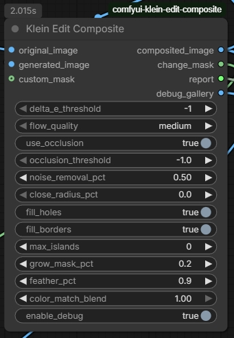

## Klein Edit Composite — ComfyUI Custom Node

### What it does
This is a **ComfyUI node** that intelligently composites a generated (AI-edited) image back onto an original image. Its core job is to detect *only what actually changed* between the two images and blend the generated content in cleanly — preserving the original background wherever it wasn't meaningfully altered.

Series of edits without the node:

Series of edits with the node:

### How it works

The pipeline runs roughly in this order:

1. **Alignment (Two-Pass SIFT + Homography):** Uses SIFT feature matching with CLAHE preprocessing and MAGSAC outlier rejection to correct any camera/perspective shift between the original and generated image. A second pass refines alignment using only background pixels.

2. **Optical Flow (DIS):** After homography correction, dense optical flow catches any remaining sub-pixel or local motion between the two images.

3. **Difference Detection:** Computes a hybrid diff map combining perceptual color difference (Delta E in LAB color space) and structural difference (Sobel gradient magnitude). This makes it robust to minor lighting shifts while still catching real content changes.

4. **Mask Refinement:** The raw change mask is cleaned up via noise removal (opening-by-reconstruction), hole filling, island pruning, border bleed, and optional grow/shrink. An optional occlusion mask (forward-backward flow consistency check) can also be incorporated.

5. **Color Matching:** Optionally applies Reinhard color transfer (in LAB space) to match the generated image's lighting/color to the original, using only background pixels for statistics.

6. **Compositing:** The final mask is feathered using a guided filter (edge-aware smoothing) and used to alpha-blend the generated image over the original.

### Outputs
- `composited_image` — the final blended result
- `change_mask` — the detected change region
- `report` — a text summary of all parameters and statistics
- `debug_gallery` — optional visual breakdown of intermediate steps (SIFT matches, flow, diff maps, etc.)

## AI coded, I am not a developer.
